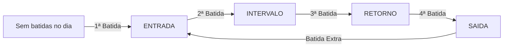

# Chronos Pulse

<div align="center">


Plataforma escalável e multi-tenant para gestão pública integrada: controle de registro de ponto eletrônico, gestão de estoque/almoxarifado com Custo Médio Ponderado (PMP), autenticação JWT por perfil (RBAC), cadastro público de empresas e sincronização offline-first.

</div>

---

## Sumário

- [Visão Geral e Funcionalidades](#visão-geral-e-funcionalidades)
- [Arquitetura Hexagonal Modular](#arquitetura-hexagonal-modular)
- [Estrutura de Perfis e Permissões (RBAC)](#estrutura-de-perfis-e-permissões-rbac)
- [Ciclo Automático de Batidas](#ciclo-automático-de-batidas)
- [Endpoints da API](#endpoints-da-api)
- [Pré-requisitos](#pré-requisitos)
- [Executando a Aplicação com Docker](#executando-a-aplicação-com-docker)
  - [Cenário 1: Linux Puro (Servidores / VPS / Ubuntu / Debian / RHEL)](#cenário-1-linux-puro-servidores--vps--distribuições-linux)
  - [Cenário 2: Windows com Docker CLI via WSL2 Ubuntu](#cenário-2-windows-com-docker-cli-via-wsl2-ubuntu)
  - [Solução de Problemas Comuns](#solução-de-problemas-comuns)
- [Execução Local com Maven](#execução-local-com-maven)
- [Dados Iniciais de Teste (Seeds)](#dados-iniciais-de-teste-seeds)
- [Coleção Insomnia](#coleção-insomnia)
- [Testes Automatizados](#testes-automatizados)
- [Stack Tecnológica e Dependências](#stack-tecnológica-e-dependências)
- [Licença](#licença)

---

## Visão Geral e Funcionalidades

- **Multi-Tenant Nativo**: Segregação de empresas clientes, colaboradores e registros com isolamento contextual por `tenant_id`.
- **Cadastro Público de Empresas**: Novas empresas podem se auto-cadastrar na plataforma via tela pública, criando automaticamente o tenant, o administrador (ADMIN_EMPRESA) e o registro de colaborador.
- **Autenticação e Autorização JWT**: Emissão de tokens Bearer (access token 1h + refresh token limitado a 8h) com extração segura de `cpcId`, `tenantId` e `role`.
- **Refresh Token**: Renovação automática do access token usando refresh token, evitando logout involuntário ao atualizar a página.
- **Tempo de Sessão (Idle + Absoluto)**: Sessão encerrada após 15 minutos de inatividade e com limite absoluto de 8 horas desde o login (verificado no backend pela validade do refresh token e no app pelo temporizador de ociosidade).
- **Ciclo Sequencial Inteligente**: Detecção automática da próxima batida da jornada (`ENTRADA` → `INTERVALO` → `RETORNO` → `SAIDA` → `ENTRADA`), eliminando divergências manuais.
- **Disparo de Comprovante de Ponto por E-mail**: Notificação instantânea e assíncrona por e-mail a cada batida de ponto ou ajuste manual, com layout HTML estilizado contendo NSR, Hash SHA-256 e dados legais (Portaria MTP nº 671/2021).
- **Sincronização Offline e em Lote**: Suporte à recepção de batidas coletadas em modo offline pelo aplicativo móvel com coordenadas GPS, precisão e hash local.
- **Integridade Criptográfica & NSR**: Cálculo de hash SHA-256 encadeado e geração de Número Sequencial de Registro (NSR) contínuo.
- **Conformidade Fiscal (Portaria 671 MTE)**: Geração e download do Arquivo Eletrônico de Jornada (AEJ) para auditoria trabalhista.
- **CRUD Completo de Colaboradores**: Cadastro, listagem, edição e exclusão (soft delete) de colaboradores com controle granular de acesso ao módulo de estoque.
- **Módulo de Estoque & Almoxarifado**: Catálogo de materiais (CATMAT), Custo Médio Ponderado (PMP/MCASP), entradas por NF-e/Empenho, saídas e requisições públicas com ciclo de aprovação.
- **Migrations com Flyway**: Versionamento automático da estrutura relacional e carga de dados de desenvolvimento (`V1` a `V7`).

---

## Arquitetura Hexagonal Modular

O sistema adota a **Arquitetura Hexagonal (Ports & Adapters)** dividida em módulos de negócio coesos e desacoplados de frameworks e persistência:

```
src/main/java/br/com/jess/chronos/pulse/
├── modules/
│   ├── auth/                # Módulo de Autenticação, Cadastro e Segurança JWT
│   │   ├── application/usecases/
│   │   │   ├── AutenticarUsuarioUseCaseImpl       # Login com JWT
│   │   │   ├── CadastrarEmpresaCompletoUseCaseImpl # Cadastro público empresa+admin
│   │   │   ├── RefreshTokenUseCaseImpl             # Renovação de access token
│   │   │   └── BuscarPerfilUseCaseImpl             # Perfil do usuário logado
│   │   ├── domain/model/ & ports/
│   │   └── infrastructure/adapters/ (REST, Security, JWT)
│   ├── empresa/             # Módulo de Gestão de Empresas (Tenants)
│   │   ├── application/usecases/
│   │   ├── domain/model/ & ports/
│   │   └── infrastructure/adapters/ (REST, JPA Persistence)
│   ├── colaborador/         # Módulo de Gestão de Colaboradores (CRUD completo)
│   │   ├── application/usecases/
│   │   │   ├── CadastrarColaboradorUseCaseImpl
│   │   │   ├── ListarColaboradoresUseCaseImpl
│   │   │   ├── AtualizarColaboradorUseCaseImpl
│   │   │   └── ExcluirColaboradorUseCaseImpl
│   │   ├── domain/model/ & ports/
│   │   └── infrastructure/adapters/ (REST, JPA Persistence)
│   ├── ponto/               # Módulo de Controle de Ponto e Fiscal
│   │   ├── domain/model/ & ports/ & service/
│   │   ├── application/usecases/
│   │   └── infrastructure/adapters/
│   │       ├── input/rest/
│   │       ├── output/persistence/
│   │       └── output/fiscal/
│   ├── estoque/             # Módulo de Estoque & Almoxarifado (MCASP/PMP)
│   │   ├── domain/entity/ & service/
│   │   ├── repository/ & service/
│   │   └── web/ (Controllers e DTOs)
│   └── notificacao/         # Módulo de Notificações por E-mail
└── infrastructure/          # Componentes transversais (Config, Flyway)
```

---

## Estrutura de Perfis e Permissões (RBAC)

| Perfil (`Role`) | Escopo | Ações Permitidas | Acesso ao Módulo de Estoque |
|---|---|---|---|
| `SUPORTE_N1` | Global / SaaS | Suporte técnico de nível 1 para tenants | Conforme configurado |
| `SUPORTE_N2` | Global / SaaS | Suporte técnico de nível 2 (avançado) | Conforme configurado |
| `ADMIN_EMPRESA` | Específico do Tenant | Cadastro/gestão completa de colaboradores, jornadas e relatórios fiscais | Sim (Irrestrito) |
| `GESTOR_RH` | Específico do Tenant | Gestão irrestrita de colaboradores, parametrização de permissão de estoque | Sim (Irrestrito) |
| `COLABORADOR` | Individual | Registro de ponto online e sincronização de batidas offline | Condicional (via flag `acessoEstoque`) |

---

## Ciclo Automático de Batidas

Ao enviar um registro via `POST /api/v1/pontos/sincronizar`, a aplicação avalia o histórico de batidas do dia para o colaborador e define a classificação automaticamente:



---

## Endpoints da API

### 1. Autenticação & Cadastro

#### `POST /api/v1/auth/login`
Autentica o usuário pelo CPF e senha, retornando tokens JWT.

```bash
curl --request POST \
  --url http://localhost:8080/api/v1/auth/login \
  --header 'Content-Type: application/json' \
  --data '{
    "cpf": "12345678901",
    "senha": "senha123"
  }'
```

**Resposta:**
```json
{
  "accessToken": "eyJhbGciOiJIUzI1NiJ9...",
  "refreshToken": "eyJhbGciOiJIUzI1NiJ9...",
  "role": "COLABORADOR",
  "cpcId": "33333333-3333-3333-3333-333333333333",
  "nome": "Colaborador Teste",
  "email": "colaborador@empresa.com.br",
  "tenantId": "a0eebc99-9c0b-4ef8-bb6d-6bb9bd380a11",
  "acessoEstoque": false
}
```

#### `POST /api/v1/auth/cadastrar-empresa` *(Público)*
Cadastro completo: cria empresa (tenant) + administrador + colaborador. Retorna tokens JWT (login automático).

```bash
curl --request POST \
  --url http://localhost:8080/api/v1/auth/cadastrar-empresa \
  --header 'Content-Type: application/json' \
  --data '{
    "cnpj": "98765432000188",
    "nomeEmpresa": "Tech Solutions Brasil LTDA",
    "responsavelNome": "João Silva",
    "responsavelCpf": "11122233344",
    "responsavelEmail": "joao@techsolutions.com.br",
    "responsavelCelular": "(11) 99999-0000",
    "responsavelSenha": "senha123"
  }'
```

#### `POST /api/v1/auth/refresh` *(Público)*
Renova o access token usando um refresh token válido (validade máxima: 8 horas desde o login — limite absoluto da sessão).

```bash
curl --request POST \
  --url http://localhost:8080/api/v1/auth/refresh \
  --header 'Content-Type: application/json' \
  --data '{
    "refreshToken": "eyJhbGciOiJIUzI1NiJ9..."
  }'
```

#### `GET /api/v1/auth/me` *(Autenticado)*
Retorna o perfil completo do usuário logado.

```bash
curl --request GET \
  --url http://localhost:8080/api/v1/auth/me \
  --header 'Authorization: Bearer <TOKEN>'
```

---

### 2. Gestão de Empresas (Tenant)

#### `POST /api/v1/empresas`
Cadastra uma nova empresa na plataforma. Uso restrito à administração da plataforma.

```bash
curl --request POST \
  --url http://localhost:8080/api/v1/empresas \
  --header 'Authorization: Bearer <TOKEN>' \
  --header 'Content-Type: application/json' \
  --data '{
    "cnpj": "98765432000188",
    "nome": "Tech Solutions Brasil LTDA"
  }'
```

---

### 3. Gestão de Colaboradores

#### `POST /api/v1/colaboradores`
Cadastra um colaborador vinculado a um tenant. Requer `ADMIN_EMPRESA` ou `GESTOR_RH`.

```bash
curl --request POST \
  --url http://localhost:8080/api/v1/colaboradores \
  --header 'Authorization: Bearer <TOKEN>' \
  --header 'Content-Type: application/json' \
  --data '{
    "cpf": "98765432100",
    "nome": "Mariana Souza",
    "emailCorporativo": "mariana.souza@empresa.com.br",
    "senha": "senhaColab123",
    "matricula": "MAT-002",
    "cargo": "Analista de Qualidade",
    "departamento": "Engenharia de Software",
    "dataNascimento": "1994-06-20",
    "dataAdmissao": "2026-09-01",
    "tenantId": "a0eebc99-9c0b-4ef8-bb6d-6bb9bd380a11",
    "acessoEstoque": true
  }'
```

#### `GET /api/v1/colaboradores`
Lista todos os colaboradores do tenant autenticado.

#### `PUT /api/v1/colaboradores/{id}`
Atualiza os dados de um colaborador (nome, email, cargo, departamento, acesso ao estoque).

```bash
curl --request PUT \
  --url http://localhost:8080/api/v1/colaboradores/{UUID_COLABORADOR} \
  --header 'Authorization: Bearer <TOKEN>' \
  --header 'Content-Type: application/json' \
  --data '{
    "nome": "Mariana Souza Lima",
    "emailCorporativo": "mariana.lima@empresa.com.br",
    "cargo": "Coordenadora de Qualidade",
    "departamento": "Engenharia de Software",
    "acessoEstoque": true
  }'
```

#### `DELETE /api/v1/colaboradores/{id}`
Desativa um colaborador e seu usuário (soft delete).

```bash
curl --request DELETE \
  --url http://localhost:8080/api/v1/colaboradores/{UUID_COLABORADOR} \
  --header 'Authorization: Bearer <TOKEN>'
```

---

### 4. Registro, Sincronização e Espelho de Ponto

#### `POST /api/v1/pontos/sincronizar`
Recebe uma ou mais batidas de ponto. O `colaboradorId` e `tenantId` são extraídos diretamente do token JWT Bearer.

```bash
curl --request POST \
  --url http://localhost:8080/api/v1/pontos/sincronizar \
  --header 'Authorization: Bearer <TOKEN_COLABORADOR>' \
  --header 'Content-Type: application/json' \
  --data '{
    "registros": [
      {
        "idLocal": "f47ac10b-58cc-4372-a567-0e02b2c3d479",
        "dataHoraDispositivo": "2026-09-03T08:00:00Z",
        "latitude": -23.550520,
        "longitude": -46.633308,
        "precisaoGps": 4.5,
        "fotoUrl": "https://s3.amazonaws.com/chronos-pulse/fotos/ponto1.jpg",
        "hashLocal": "e3b0c44298fc1c149afbf4c8996fb92427ae41e4649b934ca495991b7852b855"
      }
    ]
  }'
```

#### `GET /api/v1/pontos/espelho`
Consulta o demonstrativo mensal/espelho de ponto com todas as batidas e registros de ajustes manuais.

```bash
curl --request GET \
  --url 'http://localhost:8080/api/v1/pontos/espelho?mes=9&ano=2026' \
  --header 'Authorization: Bearer <TOKEN_COLABORADOR>'
```

#### `POST /api/v1/pontos/ajustar`
Permite a inclusão ou correção manual de marcação de ponto com seleção obrigatória de uma justificativa padronizada.

```bash
curl --request POST \
  --url http://localhost:8080/api/v1/pontos/ajustar \
  --header 'Authorization: Bearer <TOKEN_COLABORADOR>' \
  --header 'Content-Type: application/json' \
  --data '{
    "dataHora": "2026-09-03T08:00:00Z",
    "tipoRegistro": "ENTRADA",
    "justificativa": "Esquecimento de marcação",
    "observacao": "Registro esquecido no início do turno."
  }'
```

**Justificativas Padronizadas:**
1. `Esquecimento de marcação`
2. `Falha técnica`
3. `Atividade externa`
4. `Viagem a trabalho`
5. `Trabalho remoto`
6. `Atendimento médico`
7. `Autorização da liderança`
8. `Plantão ou sobreaviso`

---

### 5. Auditoria e Exportação Fiscal

#### `GET /api/v1/fiscal/aej/download`
Gera e baixa o arquivo fiscal AEJ (Portaria 671/2021).

```bash
curl --request GET \
  --url 'http://localhost:8080/api/v1/fiscal/aej/download?cnpj=12345678000195&razaoSocial=Chronos%20Pulse%20Tech%20LTDA'
```

---

### 6. Estoque & Almoxarifado Público (MCASP / PMP)

#### `GET /api/v1/estoque/saldos`
Consulta os saldos físicos e patrimoniais valorados pelo Custo Médio Ponderado (PMP).

#### `POST /api/v1/estoque/movimentacoes/entrada`
Registra entrada de material por NF-e/Empenho com recálculo automático do PMP.

#### `POST /api/v1/estoque/movimentacoes/saida`
Registra saída/baixa de material com validação de saldo.

#### `GET /api/v1/estoque/requisicoes`
Lista requisições públicas de materiais (paginado, filtrável por status).

#### `POST /api/v1/estoque/requisicoes`
Cria uma requisição de materiais para um departamento/secretaria.

#### `POST /api/v1/estoque/requisicoes/{id}/aprovar`
Aprova uma requisição pendente.

#### `POST /api/v1/estoque/requisicoes/{id}/atender`
Atende (baixa em estoque) uma requisição aprovada.

---

## Pré-requisitos

- **Ambiente Containerizado (Docker & Docker Compose)**:
  - Docker 24+ e Docker Compose v2 (nativo em Linux puro ou via WSL2 Ubuntu / Docker Desktop no Windows).
- **Ambiente de Desenvolvimento Local (Opcional / Sem Docker)**:
  - Java JDK 25+
  - Maven 3.9+ (ou utilizar o wrapper `./mvnw` / `.\mvnw.cmd`)
  - PostgreSQL 14+ (porta `5432`)

---

## Executando a Aplicação com Docker

### Cenário 1: Linux Puro (Servidores / VPS / Distribuições Linux)

#### 1. Garantir que o serviço do Docker esteja ativo
```bash
sudo systemctl enable --now docker
sudo usermod -aG docker $USER
newgrp docker
```

#### 2. Subir os Contêineres
```bash
cd /caminho/para/chronos-pulse
docker compose up --build -d
```

- A API estará disponível em: `http://localhost:8080`
- O banco PostgreSQL estará exposto na porta: `5432`

#### 3. Gerenciamento
```bash
docker compose logs -f app     # Logs da aplicação
docker compose logs -f postgres # Logs do PostgreSQL
docker compose ps              # Status dos contêineres
docker compose down            # Parar contêineres
docker compose restart         # Reiniciar serviços
```

---

### Cenário 2: Windows com Docker CLI via WSL2 Ubuntu

#### 1. Iniciar o Daemon do Docker no WSL
```powershell
wsl sudo service docker start
```

#### 2. Subindo os Contêineres
```powershell
wsl docker compose up --build -d
wsl docker compose logs -f app
wsl docker compose down
```

---

### Solução de Problemas Comuns

| Sintoma / Erro | Causa Provável | Solução |
|---|---|---|
| `Cannot connect to the Docker daemon` | O serviço do Docker não está ativo | **Linux:** `sudo systemctl start docker` / **WSL:** `wsl sudo service docker start` |
| `permission denied` | Usuário sem permissão no socket Docker | `sudo usermod -aG docker $USER && newgrp docker` |
| `dial tcp 127.0.0.1:2375: connectex` | Docker CLI executado direto no PowerShell sem Docker Desktop | Utilize `wsl docker compose up --build -d` |
| Porta 8080 ou 5432 em uso | Outro processo ocupa as portas | Pare os serviços ou altere as portas no `docker-compose.yml` |

---

## Execução Local com Maven

```bash
# Linux / macOS / WSL
./mvnw spring-boot:run

# Windows (PowerShell / CMD)
.\mvnw.cmd spring-boot:run
```

---

## Dados Iniciais de Teste (Seeds)

As migrations Flyway (`V3`, `V4`, `V5`) populam automaticamente os seguintes dados:

| Usuário | Perfil | CPF | Senha | Acesso Estoque | Tenant |
|---|---|---|---|---|---|
| **Admin Empresa** | `ADMIN_EMPRESA` | `11111111111` | `admin123` | Sim (Irrestrito) | Chronos Pulse Tech LTDA |
| **Gestor de RH** | `GESTOR_RH` | `22222222222` | `admin123` | Sim (Irrestrito) | Chronos Pulse Tech LTDA |
| **Colaborador Padrão** | `COLABORADOR` | `12345678901` | `senha123` | Não (Apenas Ponto) | Chronos Pulse Tech LTDA |
| **Colaborador Almoxarife** | `COLABORADOR` | `98765432100` | `senha123` | Sim (Ponto + Estoque) | Chronos Pulse Tech LTDA |

---

## Coleção Insomnia

A coleção de requisições completa está localizada em:
`src/test/resources/collections/Insomnia.yaml`

### Pastas organizadas na coleção:
- `Autenticação & Acesso`: Login, cadastro de empresa, refresh token e perfil.
- `Empresas (Multi-Tenant)`: Cadastro de novos tenants.
- `Colaboradores`: CRUD completo (listar, cadastrar, atualizar, excluir).
- `Gestão de Ponto`: Registro de batida, sincronização em lote e ajustes manuais.
- `Fiscal & Auditoria`: Download do arquivo AEJ.
- `Estoque & Almoxarifado`: Materiais, saldos PMP, entradas, saídas e requisições.

---

## Testes Automatizados

```bash
# Executar no Linux / macOS / WSL
./mvnw test

# Executar no Windows
.\mvnw.cmd test
```

### Cobertura de Testes por Camada e Módulo:

| Módulo | Camada / Classe | Testes | Objetivo |
|---|---|---|---|
| **Smoke** | `ChronosPulseApplicationTests` | 1 | Carregamento do contexto Spring Boot |
| **Auth** | `AutenticarUsuarioUseCaseImplTest` | 2 | Geração de token JWT, claims de estoque e validação de credenciais |
| **Empresa** | `CadastrarEmpresaUseCaseImplTest` | 2 | Regras de criação e unicidade de CNPJ |
| **Colaborador** | `CadastrarColaboradorUseCaseImplTest` | 2 | Validação de CPF, matrícula e vínculo com tenant |
| **Colaborador** | `ListarColaboradoresUseCaseImplTest` | 1 | Consulta de colaboradores com detalhes de perfil e permissão |
| **Ponto** | `RegistrarPontoUseCaseImplTest` | 4 | Ciclo automático (Entrada/Intervalo/Retorno/Saída), NSR e hash |
| **Ponto** | `GeradorHashServiceTest` | 5 | Consistência e determinismo do cálculo SHA-256 |
| **Ponto** | `SincronizacaoPontoControllerTest` | 3 | Endpoints REST de sincronização e segurança |
| **Ponto** | `RegistroPontoRepositoryAdapterTest` | 4 | Mapeamento e persistência de registros |
| **Ponto** | `ConsultarEspelhoPontoUseCaseImplTest` | 2 | Consulta de espelho de ponto mensal |
| **Ponto** | `AjustarPontoManualUseCaseImplTest` | 2 | Validação e registro de ajustes manuais |
| **Notificação** | `EmailComprovantePontoServiceTest` | 4 | Envio de comprovante por e-mail e fallback |
| **Fiscal** | `GeradorArquivoAEJAdapterTest` | 5 | Formatação e integridade do arquivo fiscal AEJ |
| **Estoque** | `CalculadoraPmpServiceTest` | 5 | Cálculo do Custo Médio Ponderado (PMP) |
| **Estoque** | `EstoqueMovimentacaoServiceTest` | 4 | Entradas, saídas com validação de saldo |
| **Estoque** | `RequisicaoServiceTest` | 4 | Ciclo de vida de requisições públicas |
| **Estoque** | `MaterialServiceTest` | 3 | Catalogação de materiais e almoxarifados |

---

## Stack Tecnológica e Dependências

| Componente | Tecnologia | Versão |
|---|---|---|
| **Linguagem** | Java | 25 |
| **Framework Base** | Spring Boot | 4.1.1 |
| **E-mail & SMTP** | Spring Mail / Gmail SMTP | 4.1.1 |
| **Segurança & JWT** | Spring Security & JJWT | 0.12.6 |
| **Persistência Relacional** | Spring Data JPA / Hibernate | 7.x |
| **Banco de Dados** | PostgreSQL | 16 |
| **Migrations** | Flyway Migration | Gerenciado |
| **Mapeamento de Objetos** | MapStruct | 1.5.5 |
| **Produtividade** | Lombok | Gerenciado |
| **Testes** | JUnit 5, Mockito, AssertJ, H2 Database | Gerenciado |
| **Containerização** | Docker & Docker Compose | Multi-Stage Build |

---

## Licença

Copyright (c) 2026 Chronos Pulse

Distribuído sob a licença MIT. Consulte o arquivo [LICENSE](LICENSE) para mais detalhes.
