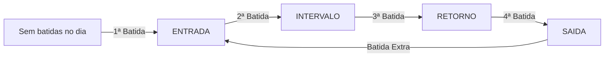

# Chronos Pulse

<div align="center">


Plataforma escalável e multi-tenant para controle de registro de ponto eletrônico, autenticação JWT por perfil (RBAC), ciclo automático de batidas de jornada, sincronização em lote offline, integridade criptográfica SHA-256 e exportação fiscal AEJ (Arquivo Eletrônico de Jornada - Portaria 671 MTE).

</div>

---

## Sumário

- [Visão Geral e Funcionalidades](#visão-geral-e-funcionalidades)
- [Arquitetura Hexagonal Modular](#arquitetura-hexagonal-modular)
- [Estrutura de Perfis e Permissões (RBAC)](#estrutura-de-perfis-e-permissões-rbac)
- [Ciclo Automático de Batidas](#ciclo-automático-de-batidas)
- [Endpoints da API](#endpoints-da-api)
- [Pré-requisitos](#pré-requisitos)
- [Executando a Aplicação](#executando-a-aplicação)
- [Dados Iniciais de Teste (Seeds)](#dados-iniciais-de-teste-seeds)
- [Coleção Insomnia](#coleção-insomnia)
- [Testes Automatizados](#testes-automatizados)
- [Stack Tecnológica e Dependências](#stack-tecnológica-e-dependências)
- [Licença](#licença)

---

## Visão Geral e Funcionalidades

- **Multi-Tenant Nativo**: Segregação de empresas clientes, colaboradores e registros com isolamento contextual.
- **Autenticação e Autorização JWT**: Emissão de tokens Bearer com extração segura de `usuarioId`, `colaboradorId`, `tenantId` e `role`.
- **Ciclo Sequencial Inteligente**: Detecção automática da próxima batida da jornada (`ENTRADA` → `INTERVALO` → `RETORNO` → `SAIDA` → `ENTRADA`), eliminando divergências manuais.
- **Sincronização Offline e em Lote**: Suporte à recepção de batidas coletadas em modo offline pelo aplicativo móvel com coordenadas GPS, precisão e hash local.
- **Integridade Criptográfica & NSR**: Cálculo de hash SHA-256 encadeado e geração de Número Sequencial de Registro (NSR) contínuo.
- **Conformidade Fiscal (Portaria 671 MTE)**: Geração e download do Arquivo Eletrônico de Jornada (AEJ) para auditoria trabalhista.
- **Migrations com Flyway**: Versionamento automático da estrutura relacional e carga de dados de desenvolvimento (`V1`, `V2`, `V3`).

---

## Arquitetura Hexagonal Modular

O sistema adota a **Arquitetura Hexagonal (Ports & Adapters)** dividida em módulos de negócio coesos e desacoplados de frameworks e persistência:

```
src/main/java/br/com/jess/chronos/pulse/
├── modules/
│   ├── auth/                # Módulo de Autenticação e Segurança JWT
│   │   ├── application/usecases/
│   │   ├── domain/model/ & ports/
│   │   └── infrastructure/adapters/ (REST, Security, JWT)
│   ├── empresa/             # Módulo de Gestão de Empresas (Tenants)
│   │   ├── application/usecases/
│   │   ├── domain/model/ & ports/
│   │   └── infrastructure/adapters/ (REST, JPA Persistence)
│   ├── colaborador/         # Módulo de Gestão de Colaboradores
│   │   ├── application/usecases/
│   │   ├── domain/model/ & ports/
│   │   └── infrastructure/adapters/ (REST, JPA Persistence)
│   └── ponto/               # Módulo de Controle de Ponto e Fiscal
│       ├── domain/model/ & ports/ & service/
│       ├── application/usecases/
│       └── infrastructure/adapters/
│           ├── input/rest/
│           ├── output/persistence/
│           └── output/fiscal/
└── infrastructure/          # Componentes transversais (Config, Flyway)
```

---

## Estrutura de Perfis e Permissões (RBAC)

| Perfil (`Role`) | Escopo | Ações Permitidas |
|---|---|---|
| `ADMIN_PLATAFORMA` | Global / SaaS | Criação de novos tenants (empresas) e administração global |
| `ADMIN_EMPRESA` | Específico do Tenant | Cadastro e gestão de colaboradores da empresa |
| `COLABORADOR` | Específico do Tenant | Registro de ponto online e sincronização de batidas offline |

---

## Ciclo Automático de Batidas

Ao enviar um registro via `POST /api/v1/pontos/sincronizar`, a aplicação avalia o histórico de batidas do dia para o colaborador e define a classificação automaticamente:



---

## Endpoints da API

### 1. Autenticação

#### `POST /api/v1/auth/login`
Autentica o usuário pelo CPF e senha, retornando o token JWT.

```bash
curl --request POST \
  --url http://localhost:8080/api/v1/auth/login \
  --header 'Content-Type: application/json' \
  --data '{
    "cpf": "12345678901",
    "senha": "senha123"
  }'
```

**Resposta:**
```json
{
  "token": "eyJhbGciOiJIUzI1NiJ9...",
  "tipo": "Bearer",
  "nome": "Colaborador Teste",
  "email": "colaborador@empresa.com.br",
  "role": "COLABORADOR",
  "tenantId": "a0eebc99-9c0b-4ef8-bb6d-6bb9bd380a11",
  "colaboradorId": "44444444-4444-4444-4444-444444444444"
}
```

---

### 2. Gestão de Empresas (Tenant)

#### `POST /api/v1/empresas`
Cadastra uma nova empresa na plataforma. Requer token com perfil `ADMIN_PLATAFORMA`.

```bash
curl --request POST \
  --url http://localhost:8080/api/v1/empresas \
  --header 'Authorization: Bearer <TOKEN_ADMIN_PLATAFORMA>' \
  --header 'Content-Type: application/json' \
  --data '{
    "cnpj": "98765432000188",
    "nome": "Tech Solutions Brasil LTDA"
  }'
```

---

### 3. Gestão de Colaboradores

#### `POST /api/v1/colaboradores`
Cadastra um colaborador vinculado a um tenant. Requer token com perfil `ADMIN_EMPRESA`.

```bash
curl --request POST \
  --url http://localhost:8080/api/v1/colaboradores \
  --header 'Authorization: Bearer <TOKEN_ADMIN_EMPRESA>' \
  --header 'Content-Type: application/json' \
  --data '{
    "cpf": "98765432100",
    "nome": "Mariana Souza",
    "emailCorporativo": "mariana.souza@empresa.com.br",
    "senha": "senhaColab123",
    "matricula": "MAT-002",
    "cargo": "Analista de Qualidade",
    "departamento": "Engenharia de Software",
    "dataNascimento": "1994-06-20",
    "dataAdmissao": "2026-09-01",
    "tenantId": "a0eebc99-9c0b-4ef8-bb6d-6bb9bd380a11",
    "configuracaoJornadaId": null
  }'
```

---

### 4. Registro e Sincronização de Ponto

#### `POST /api/v1/pontos/sincronizar`
Recebe uma ou mais batidas de ponto. O `colaboradorId` e `tenantId` são extraídos diretamente do token JWT Bearer.

```bash
curl --request POST \
  --url http://localhost:8080/api/v1/pontos/sincronizar \
  --header 'Authorization: Bearer <TOKEN_COLABORADOR>' \
  --header 'Content-Type: application/json' \
  --data '{
    "registros": [
      {
        "idLocal": "f47ac10b-58cc-4372-a567-0e02b2c3d479",
        "dataHoraDispositivo": "2026-09-03T08:00:00Z",
        "latitude": -23.550520,
        "longitude": -46.633308,
        "precisaoGps": 4.5,
        "fotoUrl": "https://s3.amazonaws.com/chronos-pulse/fotos/ponto1.jpg",
        "hashLocal": "e3b0c44298fc1c149afbf4c8996fb92427ae41e4649b934ca495991b7852b855"
      }
    ]
  }'
```

**Resposta:**
```json
{
  "idsSucesso": [
    "f47ac10b-58cc-4372-a567-0e02b2c3d479"
  ],
  "idsFalha": []
}
```

---

### 5. Auditoria e Exportação Fiscal

#### `GET /api/v1/fiscal/aej/download`
Gera e baixa o arquivo fiscal AEJ (Portaria 671/2021).

```bash
curl --request GET \
  --url 'http://localhost:8080/api/v1/fiscal/aej/download?cnpj=12345678000195&razaoSocial=Chronos%20Pulse%20Tech%20LTDA'
```

---

## Pré-requisitos

- **Ambiente Containerizado (Recomendado)**:
  - Docker 24+ e Docker Compose v2 (nativo no Linux, Windows ou via WSL2 Ubuntu)
- **Ambiente de Desenvolvimento Local**:
  - Java JDK 25+
  - Maven 3.9+ (ou utilizar o wrapper `./mvnw` / `.\mvnw.cmd`)
  - PostgreSQL 14+ (porta `5432`)

---

## Executando a Aplicação

### 1. Via Docker Compose (Recomendado)

Suba os contêineres do PostgreSQL e da aplicação Spring Boot:

```bash
docker compose up --build -d
```

- A API estará acessível em: `http://localhost:8080`
- O banco PostgreSQL estará exposto na porta: `5432`

Para verificar os logs:
```bash
docker compose logs -f app
```

Para parar o ambiente:
```bash
docker compose down
```

### 2. Execução Local com Maven

Certifique-se de que o PostgreSQL esteja em execução e inicie o Spring Boot:

**Linux / macOS / WSL:**
```bash
./mvnw spring-boot:run
```

**Windows (PowerShell / CMD):**
```powershell
.\mvnw.cmd spring-boot:run
```

---

## Dados Iniciais de Teste (Seeds)

Ao inicializar o banco de dados pela primeira vez, a migration `V3__seed_initial_data.sql` popula automaticamente os seguintes usuários para testes imediatos:

| Usuário | Perfil | CPF | Senha | Tenant |
|---|---|---|---|---|
| **Admin Plataforma** | `ADMIN_PLATAFORMA` | `00000000000` | `admin123` | Global (N/A) |
| **Gestor RH Empresa** | `ADMIN_EMPRESA` | `11111111111` | `admin123` | Chronos Pulse Tech LTDA |
| **Colaborador Teste** | `COLABORADOR` | `12345678901` | `senha123` | Chronos Pulse Tech LTDA |

---

## Coleção Insomnia

A coleção de requisições completa com rotas, variáveis e fluxos de autenticação JWT está localizada em:
`src/test/resources/collections/Insomnia.yaml`

### Como importar:
1. Abra o **Insomnia**.
2. Vá em **Application** → **Preferences** → **Data** → **Import Data** (ou clique em **Import** na tela inicial).
3. Selecione o arquivo `src/test/resources/collections/Insomnia.yaml`.

### Pastas organizadas na coleção:
- `Autenticação & Acesso`: Login para Admin Plataforma, Admin Empresa e Colaborador.
- `Empresas (Multi-Tenant)`: Cadastro de novos tenants.
- `Colaboradores`: Cadastro de colaboradores vinculados a tenant.
- `Gestão de Ponto`: Registro de batida individual com ciclo automático e sincronização em lote offline.
- `Fiscal & Auditoria`: Download do arquivo AEJ.

---

## Testes Automatizados

A aplicação conta com **29 testes automatizados** cobrindo todas as camadas da Arquitetura Hexagonal:

```bash
# Executar no Linux / macOS / WSL
./mvnw test

# Executar no Windows
.\mvnw.cmd test
```

### Cobertura de Testes por Camada e Módulo:

| Módulo | Camada / Classe | Testes | Objetivo |
|---|---|---|---|
| **Smoke** | `ChronosPulseApplicationTests` | 1 | Carregamento do contexto Spring Boot |
| **Auth** | `AutenticarUsuarioUseCaseImplTest` | 2 | Geração de token JWT e validação de credenciais |
| **Empresa** | `CadastrarEmpresaUseCaseImplTest` | 2 | Regras de criação e unicidade de CNPJ |
| **Colaborador** | `CadastrarColaboradorUseCaseImplTest` | 3 | Validação de CPF, matrícula e vínculo com tenant |
| **Ponto** | `RegistrarPontoUseCaseImplTest` | 4 | Ciclo automático (Entrada/Intervalo/Retorno/Saída), NSR e hash |
| **Ponto** | `GeradorHashServiceTest` | 5 | Consistência e determinismo do cálculo SHA-256 |
| **Ponto** | `SincronizacaoPontoControllerTest` | 3 | Endpoints REST de sincronização e segurança |
| **Ponto** | `RegistroPontoRepositoryAdapterTest` | 4 | Mapeamento e persistência de registros |
| **Fiscal** | `GeradorArquivoAEJAdapterTest` | 5 | Formatação e integridade do arquivo fiscal AEJ |

---

## Stack Tecnológica e Dependências

| Componente | Tecnologia | Versão |
|---|---|---|
| **Linguagem** | Java | 25 |
| **Framework Base** | Spring Boot | 4.1.1 |
| **Segurança & JWT** | Spring Security & JJWT (`io.jsonwebtoken`) | 0.12.6 |
| **Persistência Relacional** | Spring Data JPA / Hibernate | 7.x |
| **Banco de Dados** | PostgreSQL | 16 |
| **Migrations** | Flyway Migration | Gerenciado |
| **Mapeamento de Objetos** | MapStruct | 1.5.5 |
| **Produtividade** | Lombok | Gerenciado |
| **Testes** | JUnit 5, Mockito, AssertJ, H2 Database | Gerenciado |
| **Containerização** | Docker & Docker Compose | Multi-Stage Build |

---

## Licença

Copyright (c) 2026 Chronos Pulse

Distribuído sob a licença MIT. Consulte o arquivo [LICENSE](LICENSE) para mais detalhes.
