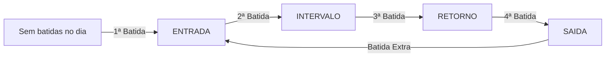

# Chronos Pulse

<div align="center">


Plataforma escalável e multi-tenant para controle de registro de ponto eletrônico, autenticação JWT por perfil (RBAC), ciclo automático de batidas de jornada, sincronização em lote offline, integridade criptográfica SHA-256 e exportação fiscal AEJ (Arquivo Eletrônico de Jornada - Portaria 671 MTE).

</div>

---

## Sumário

- [Visão Geral e Funcionalidades](#visão-geral-e-funcionalidades)
- [Arquitetura Hexagonal Modular](#arquitetura-hexagonal-modular)
- [Estrutura de Perfis e Permissões (RBAC)](#estrutura-de-perfis-e-permissões-rbac)
- [Ciclo Automático de Batidas](#ciclo-automático-de-batidas)
- [Endpoints da API](#endpoints-da-api)
- [Pré-requisitos](#pré-requisitos)
- [Executando a Aplicação com Docker](#executando-a-aplicação-com-docker)
  - [Cenário 1: Linux Puro (Servidores / VPS / Ubuntu / Debian / RHEL)](#cenário-1-linux-puro-servidores--vps--distribuições-linux)
  - [Cenário 2: Windows com Docker CLI via WSL2 Ubuntu](#cenário-2-windows-com-docker-cli-via-wsl2-ubuntu)
  - [Solução de Problemas Comuns](#solução-de-problemas-comuns)
- [Execução Local com Maven](#execução-local-com-maven)
- [Dados Iniciais de Teste (Seeds)](#dados-iniciais-de-teste-seeds)
- [Coleção Insomnia](#coleção-insomnia)
- [Testes Automatizados](#testes-automatizados)
- [Stack Tecnológica e Dependências](#stack-tecnológica-e-dependências)
- [Licença](#licença)

---

## Visão Geral e Funcionalidades

- **Multi-Tenant Nativo**: Segregação de empresas clientes, colaboradores e registros com isolamento contextual.
- **Autenticação e Autorização JWT**: Emissão de tokens Bearer com extração segura de `usuarioId`, `colaboradorId`, `tenantId` e `role`.
- **Ciclo Sequencial Inteligente**: Detecção automática da próxima batida da jornada (`ENTRADA` → `INTERVALO` → `RETORNO` → `SAIDA` → `ENTRADA`), eliminando divergências manuais.
- **Sincronização Offline e em Lote**: Suporte à recepção de batidas coletadas em modo offline pelo aplicativo móvel com coordenadas GPS, precisão e hash local.
- **Integridade Criptográfica & NSR**: Cálculo de hash SHA-256 encadeado e geração de Número Sequencial de Registro (NSR) contínuo.
- **Conformidade Fiscal (Portaria 671 MTE)**: Geração e download do Arquivo Eletrônico de Jornada (AEJ) para auditoria trabalhista.
- **Migrations com Flyway**: Versionamento automático da estrutura relacional e carga de dados de desenvolvimento (`V1`, `V2`, `V3`).

---

## Arquitetura Hexagonal Modular

O sistema adota a **Arquitetura Hexagonal (Ports & Adapters)** dividida em módulos de negócio coesos e desacoplados de frameworks e persistência:

```
src/main/java/br/com/jess/chronos/pulse/
├── modules/
│   ├── auth/                # Módulo de Autenticação e Segurança JWT
│   │   ├── application/usecases/
│   │   ├── domain/model/ & ports/
│   │   └── infrastructure/adapters/ (REST, Security, JWT)
│   ├── empresa/             # Módulo de Gestão de Empresas (Tenants)
│   │   ├── application/usecases/
│   │   ├── domain/model/ & ports/
│   │   └── infrastructure/adapters/ (REST, JPA Persistence)
│   ├── colaborador/         # Módulo de Gestão de Colaboradores
│   │   ├── application/usecases/
│   │   ├── domain/model/ & ports/
│   │   └── infrastructure/adapters/ (REST, JPA Persistence)
│   └── ponto/               # Módulo de Controle de Ponto e Fiscal
│       ├── domain/model/ & ports/ & service/
│       ├── application/usecases/
│       └── infrastructure/adapters/
│           ├── input/rest/
│           ├── output/persistence/
│           └── output/fiscal/
└── infrastructure/          # Componentes transversais (Config, Flyway)
```

---

## Estrutura de Perfis e Permissões (RBAC)

| Perfil (`Role`) | Escopo | Ações Permitidas | Acesso ao Módulo de Estoque |
|---|---|---|---|
| `ADMIN_PLATAFORMA` | Global / SaaS | Criação de novos tenants (empresas) e administração irrestrita da plataforma | Sim (Irrestrito) |
| `ADMIN_EMPRESA` | Específico do Tenant | Cadastro/gestão completa de colaboradores, jornadas e relatórios fiscais | Sim (Irrestrito) |
| `GESTOR_RH` | Específico do Tenant | Gestão irrestrita de colaboradores, parametrização de permissão de estoque | Sim (Irrestrito) |
| `COLABORADOR` | Individual | Registro de ponto online e sincronização de batidas offline | Condicional (via flag `acessoEstoque`) |

---

## Ciclo Automático de Batidas

Ao enviar um registro via `POST /api/v1/pontos/sincronizar`, a aplicação avalia o histórico de batidas do dia para o colaborador e define a classificação automaticamente:



---

## Endpoints da API

### 1. Autenticação

#### `POST /api/v1/auth/login`
Autentica o usuário pelo CPF e senha, retornando o token JWT.

```bash
curl --request POST \
  --url http://localhost:8080/api/v1/auth/login \
  --header 'Content-Type: application/json' \
  --data '{
    "cpf": "12345678901",
    "senha": "senha123"
  }'
```

**Resposta:**
```json
{
  "token": "eyJhbGciOiJIUzI1NiJ9...",
  "tipo": "Bearer",
  "nome": "Colaborador Teste",
  "email": "colaborador@empresa.com.br",
  "role": "COLABORADOR",
  "tenantId": "a0eebc99-9c0b-4ef8-bb6d-6bb9bd380a11",
  "colaboradorId": "44444444-4444-4444-4444-444444444444"
}
```

---

### 2. Gestão de Empresas (Tenant)

#### `POST /api/v1/empresas`
Cadastra uma nova empresa na plataforma. Requer token com perfil `ADMIN_PLATAFORMA`.

```bash
curl --request POST \
  --url http://localhost:8080/api/v1/empresas \
  --header 'Authorization: Bearer <TOKEN_ADMIN_PLATAFORMA>' \
  --header 'Content-Type: application/json' \
  --data '{
    "cnpj": "98765432000188",
    "nome": "Tech Solutions Brasil LTDA"
  }'
```

---

### 3. Gestão de Colaboradores

#### `POST /api/v1/colaboradores`
Cadastra um colaborador vinculado a um tenant. Requer token com perfil `ADMIN_EMPRESA`.

```bash
curl --request POST \
  --url http://localhost:8080/api/v1/colaboradores \
  --header 'Authorization: Bearer <TOKEN_ADMIN_EMPRESA>' \
  --header 'Content-Type: application/json' \
  --data '{
    "cpf": "98765432100",
    "nome": "Mariana Souza",
    "emailCorporativo": "mariana.souza@empresa.com.br",
    "senha": "senhaColab123",
    "matricula": "MAT-002",
    "cargo": "Analista de Qualidade",
    "departamento": "Engenharia de Software",
    "dataNascimento": "1994-06-20",
    "dataAdmissao": "2026-09-01",
    "tenantId": "a0eebc99-9c0b-4ef8-bb6d-6bb9bd380a11",
    "configuracaoJornadaId": null
  }'
```

---

### 4. Registro e Sincronização de Ponto

#### `POST /api/v1/pontos/sincronizar`
Recebe uma ou mais batidas de ponto. O `colaboradorId` e `tenantId` são extraídos diretamente do token JWT Bearer.

```bash
curl --request POST \
  --url http://localhost:8080/api/v1/pontos/sincronizar \
  --header 'Authorization: Bearer <TOKEN_COLABORADOR>' \
  --header 'Content-Type: application/json' \
  --data '{
    "registros": [
      {
        "idLocal": "f47ac10b-58cc-4372-a567-0e02b2c3d479",
        "dataHoraDispositivo": "2026-09-03T08:00:00Z",
        "latitude": -23.550520,
        "longitude": -46.633308,
        "precisaoGps": 4.5,
        "fotoUrl": "https://s3.amazonaws.com/chronos-pulse/fotos/ponto1.jpg",
        "hashLocal": "e3b0c44298fc1c149afbf4c8996fb92427ae41e4649b934ca495991b7852b855"
      }
    ]
  }'
```

**Resposta:**
```json
{
  "idsSucesso": [
    "f47ac10b-58cc-4372-a567-0e02b2c3d479"
  ],
  "idsFalha": []
}
```

---

### 5. Auditoria e Exportação Fiscal

#### `GET /api/v1/fiscal/aej/download`
Gera e baixa o arquivo fiscal AEJ (Portaria 671/2021).

```bash
curl --request GET \
  --url 'http://localhost:8080/api/v1/fiscal/aej/download?cnpj=12345678000195&razaoSocial=Chronos%20Pulse%20Tech%20LTDA'
```

---

### 6. Estoque & Almoxarifado Público (MCASP / PMP)

#### `GET /api/v1/estoque/saldos`
Consulta os saldos físicos e patrimoniais valorados pelo Custo Médio Ponderado (PMP).

```bash
curl --request GET \
  --url 'http://localhost:8080/api/v1/estoque/saldos' \
  --header 'Authorization: Bearer <TOKEN_JWT>'
```

#### `POST /api/v1/estoque/movimentacoes/entrada`
Registra entrada de material por NF-e/Empenho com recálculo automático do PMP.

```bash
curl --request POST \
  --url 'http://localhost:8080/api/v1/estoque/movimentacoes/entrada' \
  --header 'Authorization: Bearer <TOKEN_JWT>' \
  --header 'Content-Type: application/json' \
  --data '{
    "materialId": "UUID_DO_MATERIAL",
    "almoxarifadoId": "UUID_DO_ALMOXARIFADO",
    "quantidade": 100.0,
    "valorUnitario": 25.50,
    "numeroDocumento": "NF-10293",
    "numeroEmpenho": "2026NE00142",
    "tipoDocumento": "NOTA_FISCAL"
  }'
```

#### `POST /api/v1/estoque/requisicoes`
Cria uma requisição de materiais para um departamento/secretaria.

```bash
curl --request POST \
  --url 'http://localhost:8080/api/v1/estoque/requisicoes' \
  --header 'Authorization: Bearer <TOKEN_JWT>' \
  --header 'Content-Type: application/json' \
  --data '{
    "departamentoDestino": "Secretaria de Obras",
    "justificativa": "Materiais para manutenção predial",
    "itens": [
      {
        "materialId": "UUID_DO_MATERIAL",
        "quantidadeRequisitada": 5.0
      }
    ]
  }'
```

---

## Pré-requisitos

- **Ambiente Containerizado (Docker & Docker Compose)**:
  - Docker 24+ e Docker Compose v2 (nativo em Linux puro ou via WSL2 Ubuntu / Docker Desktop no Windows).
  - Em ambientes **Linux Puro**, certifique-se de que o daemon do Docker esteja ativo via `systemctl`.
  - No **Windows com WSL2 Ubuntu** (Docker CLI sem Docker Desktop), certifique-se de iniciar o serviço (`wsl sudo service docker start`).
- **Ambiente de Desenvolvimento Local (Opcional / Sem Docker)**:
  - Java JDK 25+
  - Maven 3.9+ (ou utilizar o wrapper `./mvnw` / `.\mvnw.cmd`)
  - PostgreSQL 14+ (porta `5432`)

---

## Executando a Aplicação com Docker

---

### Cenário 1: Linux Puro (Servidores / VPS / Distribuições Linux)

Para executar a aplicação diretamente em uma máquina Linux (Ubuntu Server, Debian, CentOS, AlmaLinux, Rocky Linux, Fedora, Arch Linux ou instâncias em nuvem AWS EC2, GCP, Azure, DigitalOcean):

#### 1. Garantir que o serviço do Docker esteja ativo
```bash
# Iniciar e habilitar o daemon do Docker no boot do sistema:
sudo systemctl enable --now docker

# (Recomendado) Adicionar seu usuário ao grupo docker para executar comandos sem 'sudo':
sudo usermod -aG docker $USER

# Aplicar a nova permissão de grupo na sessão atual:
newgrp docker
```

#### 2. Subir os Contêineres
Navegue até o diretório do projeto e execute o build e inicialização dos serviços em segundo plano:
```bash
# Clone ou acesse a pasta do projeto:
cd /caminho/para/chronos-pulse

# Constrói a imagem da aplicação e sobe os contêineres:
docker compose up --build -d
```

- A API estará disponível em: `http://localhost:8080` (ou `http://IP_DO_SERVIDOR:8080`)
- O banco PostgreSQL estará exposto na porta: `5432`

#### 3. Gerenciamento e Monitoramento no Linux
```bash
# Acompanhar logs em tempo real da aplicação Spring Boot:
docker compose logs -f app

# Acompanhar logs do PostgreSQL:
docker compose logs -f postgres

# Verificar status de saúde dos contêineres:
docker compose ps

# Parar e remover contêineres (os dados do PostgreSQL permanecem salvos no volume):
docker compose down

# Reiniciar os serviços:
docker compose restart
```

#### 4. Liberação de Firewall (Opcional para Servidores / VPS)
Se o servidor possuir firewall ativo e você precisar de acesso externo à API:
```bash
# UFW (Ubuntu / Debian):
sudo ufw allow 8080/tcp
sudo ufw reload

# Firewalld (CentOS / RHEL / AlmaLinux / Rocky Linux / Fedora):
sudo firewall-cmd --permanent --add-port=8080/tcp
sudo firewall-cmd --reload
```

---

### Cenário 2: Windows com Docker CLI via WSL2 Ubuntu

Se você utiliza Windows com **Docker CLI instalado nativamente no WSL2 Ubuntu** (sem a interface gráfica do Docker Desktop ou Rancher Desktop):

#### 1. Pré-requisito: Iniciar o Daemon do Docker no WSL
O daemon precisa ser iniciado previamente antes de invocar o compose:

**Pelo terminal do Ubuntu (WSL):**
```bash
sudo service docker start
```

**Ou diretamente pelo PowerShell / Terminal do Windows:**
```powershell
wsl sudo service docker start
```

#### 2. Subindo os Contêineres
Você pode optar por executar pelo PowerShell ou dentro do terminal WSL:

**Opção A: Diretamente no PowerShell (Recomendado)**
```powershell
# Executa o compose delegando ao WSL:
wsl docker compose up --build -d

# Acompanhar logs:
wsl docker compose logs -f app

# Encerrar contêineres:
wsl docker compose down
```

**Opção B: Dentro do Terminal WSL Ubuntu**
```bash
cd /mnt/c/app/chronos-pulse
docker compose up --build -d
docker compose logs -f app
```

---

### Solução de Problemas Comuns

| Sintoma / Erro | Causa Provável | Solução |
|---|---|---|
| `Cannot connect to the Docker daemon at unix:///var/run/docker.sock. Is the docker daemon running?` | O serviço do Docker não está ativo na máquina Linux ou no WSL Ubuntu. | **Linux Puro:** `sudo systemctl start docker`<br>**WSL Ubuntu:** `wsl sudo service docker start` |
| `permission denied while trying to connect to the Docker daemon socket` | O usuário atual não possui permissão para acessar o socket do Docker sem `sudo`. | Adicione o usuário ao grupo docker: `sudo usermod -aG docker $USER && newgrp docker` |
| `dial tcp 127.0.0.1:2375: connectex: No connection could be made because the target machine actively refused it` | O comando `docker compose` foi executado diretamente no PowerShell do Windows sem o Docker Desktop nativo do Windows estar ativo. | Utilize o prefixo `wsl docker compose up --build -d` para executar via WSL. |
| Porta 8080 ou 5432 já em uso (`address already in use`) | Outro processo local (ex: PostgreSQL local ou outra API) está ocupando as portas. | Pare os serviços locais ou altere as portas de mapeamento no arquivo `docker-compose.yml`. |

---

## Execução Local com Maven

Caso deseje executar a aplicação sem contêineres, certifique-se de que o PostgreSQL esteja em execução e inicie o Spring Boot:

**Linux / macOS / WSL:**
```bash
./mvnw spring-boot:run
```

**Windows (PowerShell / CMD):**
```powershell
.\mvnw.cmd spring-boot:run
```

---

## Dados Iniciais de Teste (Seeds)

Ao inicializar o banco de dados pela primeira vez, as migrations Flyway (`V3__seed_initial_data.sql`, `V4__create_modulo_estoque_almoxarifado.sql` e `V5__add_gestor_rh_and_acesso_estoque.sql`) populam automaticamente os seguintes usuários e dados de teste:

| Usuário | Perfil | CPF | Senha | Acesso Estoque | Tenant |
|---|---|---|---|---|---|
| **Admin Plataforma** | `ADMIN_PLATAFORMA` | `00000000000` | `admin123` | Sim (Irrestrito) | Global (N/A) |
| **Admin Empresa** | `ADMIN_EMPRESA` | `11111111111` | `admin123` | Sim (Irrestrito) | Chronos Pulse Tech LTDA |
| **Gestor de RH** | `GESTOR_RH` | `22222222222` | `admin123` | Sim (Irrestrito) | Chronos Pulse Tech LTDA |
| **Colaborador Padrão** | `COLABORADOR` | `12345678901` | `senha123` | Não (Apenas Ponto) | Chronos Pulse Tech LTDA |
| **Colaborador Almoxarife** | `COLABORADOR` | `98765432100` | `senha123` | Sim (Ponto + Estoque) | Chronos Pulse Tech LTDA |

---

## Coleção Insomnia

A coleção de requisições completa com rotas, variáveis e fluxos de autenticação JWT está localizada em:
`src/test/resources/collections/Insomnia.yaml`

### Como importar:
1. Abra o **Insomnia**.
2. Vá em **Application** → **Preferences** → **Data** → **Import Data** (ou clique em **Import** na tela inicial).
3. Selecione o arquivo `src/test/resources/collections/Insomnia.yaml`.

### Pastas organizadas na coleção:
- `Autenticação & Acesso`: Login para Admin Plataforma, Admin Empresa, Gestor de RH, Colaborador Padrão e Colaborador Almoxarife.
- `Empresas (Multi-Tenant)`: Cadastro de novos tenants.
- `Colaboradores`: Listagem e cadastro de colaboradores com parametrização de permissão de estoque.
- `Gestão de Ponto`: Registro de batida individual com ciclo automático e sincronização em lote offline.
- `Fiscal & Auditoria`: Download do arquivo AEJ.
- `Estoque & Almoxarifado`: Catálogo de materiais, consulta de saldos físicos/patrimoniais (PMP), entradas por NF-e/empenho, saídas e requisições públicas.

---

## Testes Automatizados

A aplicação conta com **45 testes automatizados** no backend Spring Boot e **11 testes** no app Flutter, todos cobrindo integralmente as regras de negócio:

```bash
# Executar no Linux / macOS / WSL
./mvnw test

# Executar no Windows
.\mvnw.cmd test
```

### Cobertura de Testes por Camada e Módulo:

| Módulo | Camada / Classe | Testes | Objetivo |
|---|---|---|---|
| **Smoke** | `ChronosPulseApplicationTests` | 1 | Carregamento do contexto Spring Boot |
| **Auth** | `AutenticarUsuarioUseCaseImplTest` | 2 | Geração de token JWT, claims de estoque e validação de credenciais |
| **Empresa** | `CadastrarEmpresaUseCaseImplTest` | 2 | Regras de criação e unicidade de CNPJ |
| **Colaborador** | `CadastrarColaboradorUseCaseImplTest` | 2 | Validação de CPF, matrícula e vínculo com tenant |
| **Colaborador** | `ListarColaboradoresUseCaseImplTest` | 1 | Consulta de colaboradores com detalhes de perfil e permissão |
| **Ponto** | `RegistrarPontoUseCaseImplTest` | 4 | Ciclo automático (Entrada/Intervalo/Retorno/Saída), NSR e hash |
| **Ponto** | `GeradorHashServiceTest` | 5 | Consistência e determinismo do cálculo SHA-256 |
| **Ponto** | `SincronizacaoPontoControllerTest` | 3 | Endpoints REST de sincronização e segurança |
| **Ponto** | `RegistroPontoRepositoryAdapterTest` | 4 | Mapeamento e persistência de registros |
| **Fiscal** | `GeradorArquivoAEJAdapterTest` | 5 | Formatação e integridade do arquivo fiscal AEJ |
| **Estoque** | `CalculadoraPmpServiceTest` | 5 | Cálculo do Custo Médio Ponderado (PMP - MCASP) e arredondamentos |
| **Estoque** | `EstoqueMovimentacaoServiceTest` | 4 | Entradas, saídas com validação de saldo e recálculo contábil |
| **Estoque** | `RequisicaoServiceTest` | 4 | Ciclo de vida de requisições públicas e baixa de estoque |
| **Estoque** | `MaterialServiceTest` | 3 | Catalogação de materiais e almoxarifados multi-tenant |

---

## Stack Tecnológica e Dependências

| Componente | Tecnologia | Versão |
|---|---|---|
| **Linguagem** | Java | 25 |
| **Framework Base** | Spring Boot | 4.1.1 |
| **Segurança & JWT** | Spring Security & JJWT (`io.jsonwebtoken`) | 0.12.6 |
| **Persistência Relacional** | Spring Data JPA / Hibernate | 7.x |
| **Banco de Dados** | PostgreSQL | 16 |
| **Migrations** | Flyway Migration | Gerenciado |
| **Mapeamento de Objetos** | MapStruct | 1.5.5 |
| **Produtividade** | Lombok | Gerenciado |
| **Testes** | JUnit 5, Mockito, AssertJ, H2 Database | Gerenciado |
| **Containerização** | Docker & Docker Compose | Multi-Stage Build |

---

## Licença

Copyright (c) 2026 Chronos Pulse

Distribuído sob a licença MIT. Consulte o arquivo [LICENSE](LICENSE) para mais detalhes.
